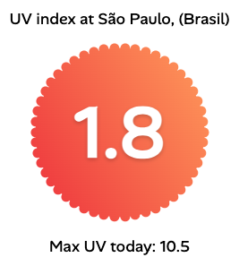

# UV Index

Quick and easy UV index info in your location.

Want to decide whether you should put on some sun screen? Well, tough luck if you don't have a UV index indication in your weather app, and finding it online isn't any easier, having to sift through UV tables.

With this UV index app you get a quick glance at the current UV index, and today's max.

Also, hourly changes can be pretty significant, so the hourly index indication might not be enough. This is why we are actually using a weighted average, which should be more accurate.
