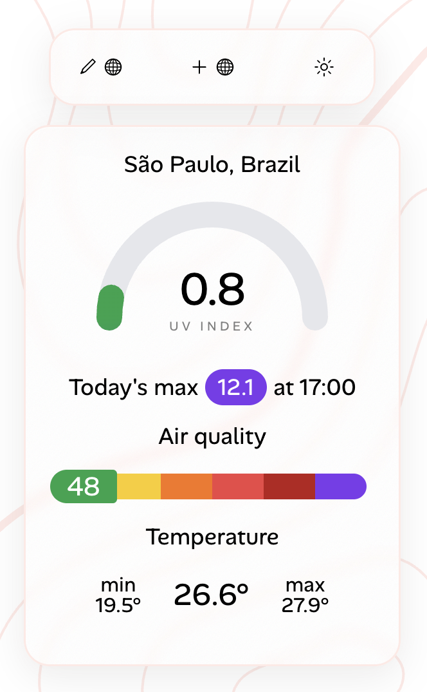

# UV Index

Quick and easy UV index info.

See it live: https://ronny011.github.io/uv-index/

    

Want to decide whether you should put on some sun screen? Well, tough luck if you don't have a UV index indication in your weather app, and finding it online isn't any easier, having to sift through UV tables.

With this UV index app you get a quick glance at the current UV index, and today's max.

Also, hourly changes can be pretty significant, so the hourly index indication might not be enough. This is why we are actually using a weighted average, which should be more accurate.

To give a better 'big picture' view of the weather, we have added Air Quality Index, and Temperature as well.

Lastly, you don't hanve to choose your device location. Just search and add any city!

## Development

This project uses `bun` as the package manager.

Install dependencies:

`bun install --frozen-lockfile`

Run locally:

`bun run dev`

Build:

`bun run build`

Lint:

`bun run lint`
